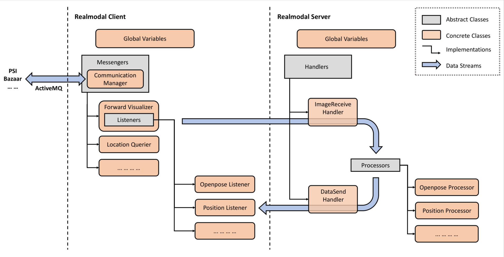

# Realmodal Document
This is a document which has everything you need to know if you want to make modifications.

- [Realmodal Document](#realmodal-document)
  * [Requirements and Quick Start](#requirements-and-quick-start)
  * [Configuration Details](#configuration-details)
    + [Overview](#overview)
    + [Meta-Information](#meta-information)
    + [Address](#address)
    + [Components](#components)
      - [Common Properties](#common-properties)
      - [Component-specific Properties](#component-specific-properties)
        * [Position](#position)
    + [Messengers (Client)](#messengers--client-)
      - [Forward Visualizer](#forward-visualizer)
      - [Location Querier](#location-querier)
      - [Dialog Messenger](#dialog-messenger)
    + [Handler (Server)](#handler--server-)
    + [Cameras](#cameras)

## Requirements and Quick Start
Refer to [readme.md](../readme.md). 
## Realmodal Architecture

The figure shows the conceptual architecture of Realmodal. Generally speaking, Realmodal consists of two parts, 
**Realmodal Client** and **Realmodal Server**. 
### Realmodal Client
Realmodal Client is the part running on the local machine. It's designed to communicate directly with other modules via
ActiveMQ, and forward the messages to the server for further processing. 

### Messenger
Messengers are the core parts of Client. As the name illustrates, a messenger will carry data coming from ActiveMQ 
and send them to the server. During running, a client can create several messengers to process different kinds of data 
separately.

Messengers use **CommunicationManager** to communicating with other modules via ActiveMQ. When the client begins to run,
an overall CommunicationManager is created and stored in `self.cm` for every messenger. A messenger can use method 
`subscribe_to` to subscribe to topics. Afterwards, when new data under the topic come in, the method `on_message` will 
be called. If you want send message to other modules, you can use `send` method. 

At the beginning of the client, the `start` method will be called. You can define some events here but it's optional.   

The messenger is designed to forward message from other modules to the server. However, a messenger can be manually 
designed for more functions. For example, it can be designed to visualize the incoming data and processing results, or 
do simple processing work without sending the data to the server.


   
## Configuration Details
### Overview
Our project uses `.yaml` file to manage configurations between different settings. It is a language similar to `.json` 
but more readable for human. One needs to learn some basic `.yaml` grammar to use this but don't worry, it's simple.

In the project, we use [OmegaConf](https://github.com/omry/omegaconf) to load the configurations from `.yaml` file. The
configuration dictionary is stored as a `DictConfig` object, and there are three ways to fetch a property from the 
dictionary. As an example, to get the `config_name` property from the primitive object, the following 3 lines are 
equivalent and will print "Sigdial 2020 - Demo" to console:
```python
print(config.config_name)
print(config["config_name"])
print(config.get("config_name"))
```
There is a small difference when using the third method. When the key is missing in the dictionary, the `get` method 
will return `None` as the default value. You can also specify this default value by passing it to the method as:
```python
print(config.get("config_name", "Default Configuration"))
```

For most components of this project, configurations are passed and stored in `self.config` for later use.

### Meta-Information
* **config_name**: a string. The name of this configuration.
* **config_version**: a string. The version of this configuration.
* **debug**: True or False. When turning on, Realmodal will print more information to the console for easier debugging.
*May be removed or changed in recent future*.

### Address
The address of the server. The server will set up services on specified ports and communicate with the client.

In order to check your ip address of the server, one can use the command:
```shell script
ifconfig -a
``` 
* **ip**: a string of the format `x.x.x.x`. The ip address of the server. Currently, only ipv4 addresses are supported.
* **port**: two integer numbers named **upstream** and **downstream**. Available ports on the server to build 
communication. 

### Components
Components are those attachable modules that are used to process multimodal data sent to server. Although they could be 
deployed only on one end, most components works in pair, i.e. a listener on the client and a corresponding 
processor on the server. Therefore, in the configuration file, the component properties are merged into one and will be 
shared by listeners and processors.
#### Common Properties
* **topic**: a string. Topic used as an identifier for the handler and the messenger to distinguish which component is
processing the data. 
* **process_interval**: a float number. Minimum intervals allowed for each component to process the incoming data. This
is designed to resolve the increasing latency issue due to the limit of network bandwidth. If the system is suffering 
this issue, try to increase this value. *(Or try to fix it using a better design of network transmission)*
* **init_param**: a dictionary. Parameters used to do the initialization. These parameters will be passed to the 
`initialize()` method of the processors after they're created to do certain initialization steps.
#### Component-specific Properties
Currently, face recognition and Openpose don't require additional properties. 
##### Position
* **backend**: a string in `{openpose, face_recognition}` (case insensitive). The backend module used to calculate the 
position information. Make sure the corresponding module is also activated.
* **topic_to_psi**: a string. The ActiveMQ topic used to notify other modules of the position information.
* **single_camera_distance**: a float number. The distance from the target to the camera used to calculate position when
only one camera without the depth information is used.
* **display_size**: a list containing two integers. The height and width (in pixel) of the window showing the layout of
the room and people's position.
* **display_margin**: the margin between the layout to the window's edges. 
* **room_corner**: a list containing several 3D points. Coordinates of room corners (in centimeter). Please list them 
clockwise or counterclockwise to avoid crossing lines.

### Messengers (Client)
Messengers are defined under the key `client`. Here, you can specify the messengers you are using in this project, and 
customize properties for them. The client will look up every key included under it from the global variable lists,
create the corresponding messenger, and initialize it with the value as parameters.
#### Forward Visualizer
The ForwardVisualizer is built to forward the multimodal stream from other modules(PSI, etc.) via ActiveMQ to the 
server, while visualize the results of server processors in the client end.  
* **address**: address to communicate with the server. See [Address](#address) section.
* **listeners**: components used. See [Components](#components) section.
* **topic**: a string. The topic of the ActiveMQ used for the messenger to receive image from other modules.
* **psi_image_format**: a string in `{raw, jpg}`. The format of image received from PSI. Using `.jpg` format can reduce 
the occupation of bandwidth much while may result in a slight loss of image quality.
* **display_camera**: a list of strings. The cameras ids to display the processor results.
#### Location Querier
The LocationQuerier is built to query Kinect about the depth information for more accurate position estimation.
* **topic_in**: a string. The topic of ActiveMQ used to receive the depth information from PSI.
* **topic_out**: a string. The topic of ActiveMQ used to query PSI about the point of interest.
#### Dialog Messenger
*This module is not used in the demo and may need further debugging. It's designed to work like bazaar but can use other 
dialog agents including neural agents.*

### Handler (Server)
Handlers are defined under the key `server`. Here, you can specify the handler you are using to receive data from client
and send results back. 
* **address**: address to listen and send data to the client. See [Address](#address) section.
* **processors**: components used. See [Components](#components) section.
* **recv_server**: a string. Name of the handler to receive data from the client.
* **send_server**: a string. Name of the handler to send results back to the client.

### Cameras
The list of cameras in use and their properties are defined under the key `camera`. Every key in this dictionary is the 
id of a camera.

All the points, vectors defined here are in the real-world coordinate system. (Unit: centimeter) 
* **type**: a string. The type of the camera. Currently only `webcam` is available.
* **pos_camera**: a 3D point. The position of the camera.
* **dir_camera**: a 3D point(representing a vector). The direction of the camera. You can measure it by calculating the
difference between the real-world point of the image center and the position of the camera.
* **dir_x**: a 3D point(representing a vector). The direction of the horizontal axis(x_axis). *Currently it should be
set perpendicular to `dir_camera`. However, mathematically, as long as it's in the horizontal plane, it should work.*
* **theta**: a float number. The vertical span angle of the camera. If not provided, it will be inferred from `phi` and 
`whratio`.
* **phi**: a float number. The horizontal span angle of the camera. If not provided, it will be inferred from `theta` 
and `whratio`.
* **whratio**: a float number. The aspect ratio of the image. If not provided, it will be inferred from `phi` and 
`theta`. 